Продолжаем работать с конфигурацией, которую разрабатывали в прошлом семестре.

Задание. Необходимо повторить действия описанные в лекции:
1. Создайте план видов характеристик для хранения свойств(характеристик) товаров (или другого подходящего объекта  исходя из темы ЛР). Нужно придумать несколько 3-5 свойств/характеристик
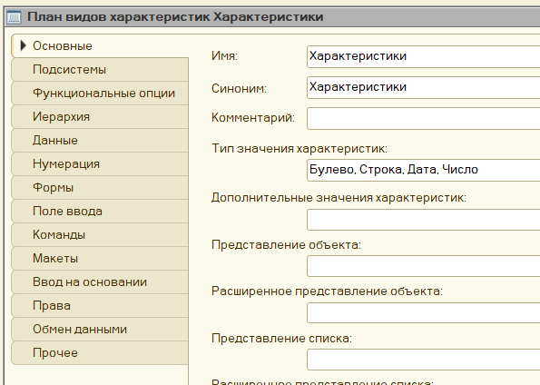
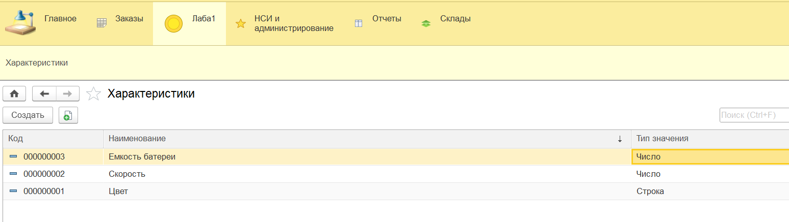

2. Необходимо реализовать хранение возможных значений характеристик двумя способами:
	a. в табличной части Объекта-Владельца справочника;
	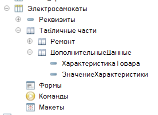
	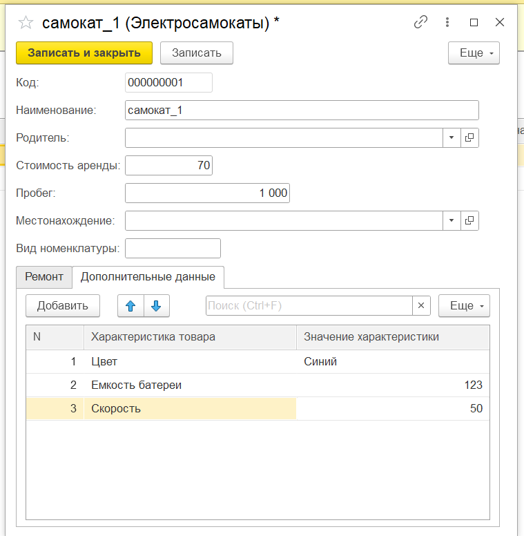
	b. в Регистре Сведений (создайте новый)
	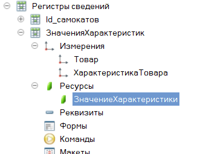
	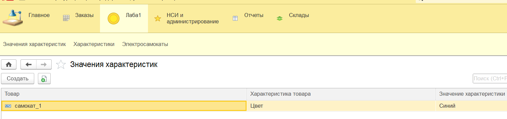

3. Создать справочник подчиненный ПВХ для хранения вариантов значений 
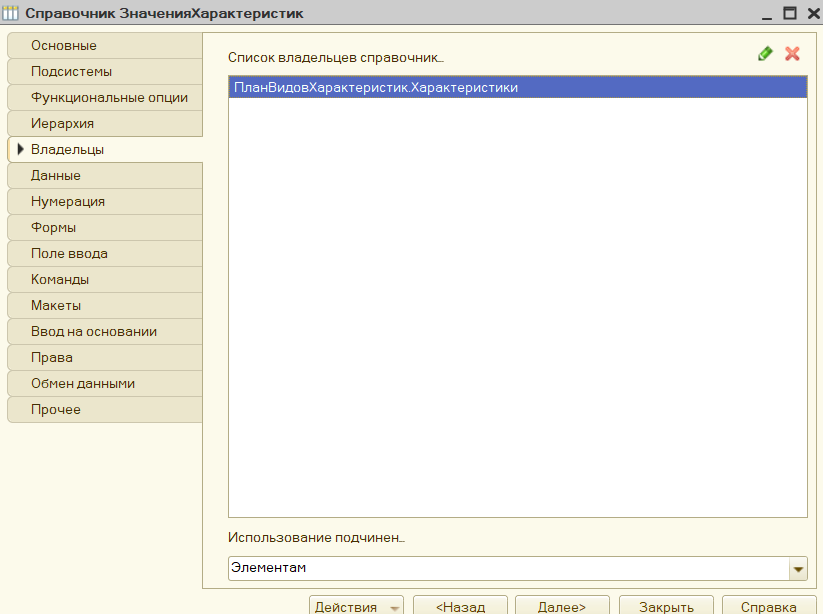
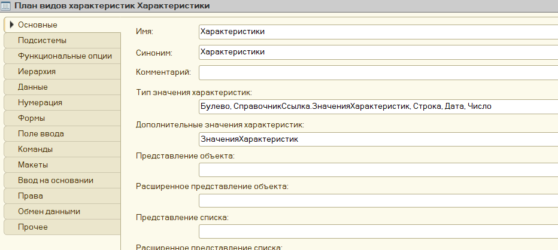
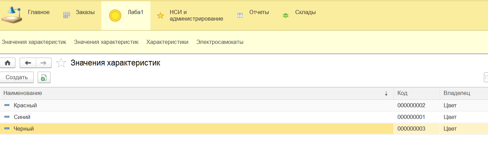
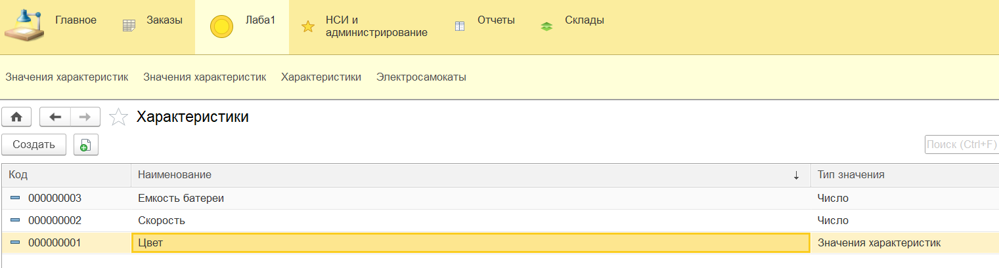

4. Добавьте в документы прихода и расхода реквизит “Характеристика” и при проведении документов сохраняйте значение характеристики в соответствующий регистр (см. ЛР №3), предварительно добавив туда данную характеристику как измерение
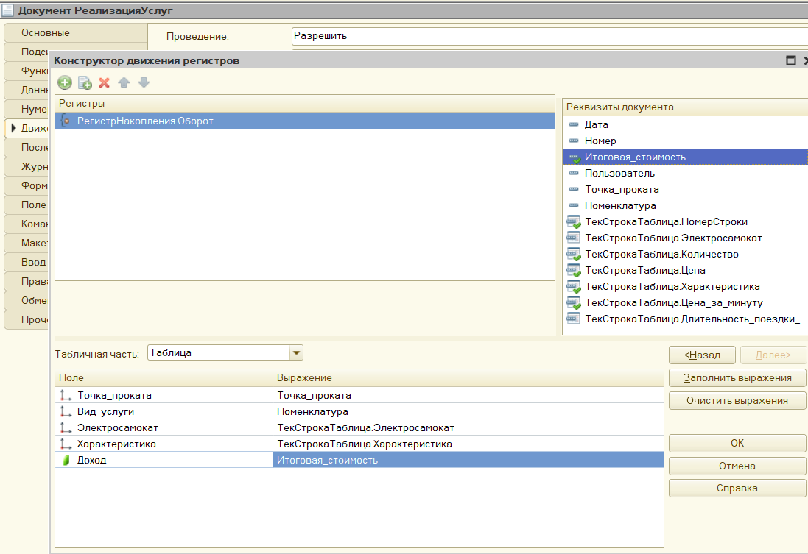
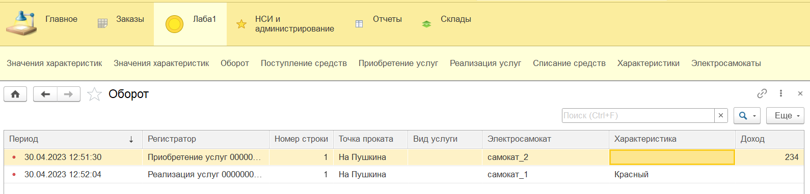
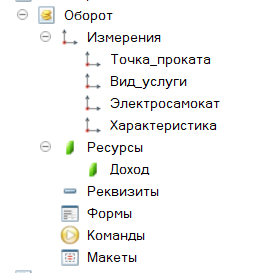
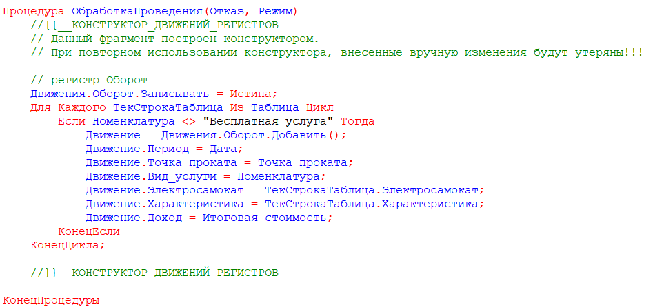

