Лабораторная работа №3 “Регистр расчета”

Задание основано на лекции 4.

1. Создайте план видов расчета «Начисления», в нем будут содержаться виды расчетов, имеющие протяженность во времени. Создайте предопределенные элементы – Оклад по тарифу и Невыход сотрудника.
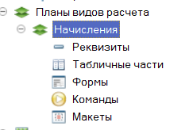
2. Создайте документ «Начисление оклада» и «Невыход сотрудника», определите структуру этих документов.
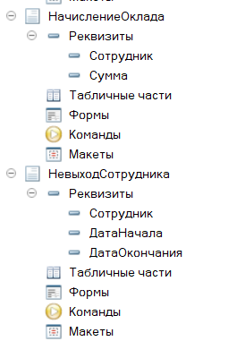
3. Создайте регистр расчета «Начисления». Он будет хранить данные о начисленной заработной плате в разрезе сотрудников.
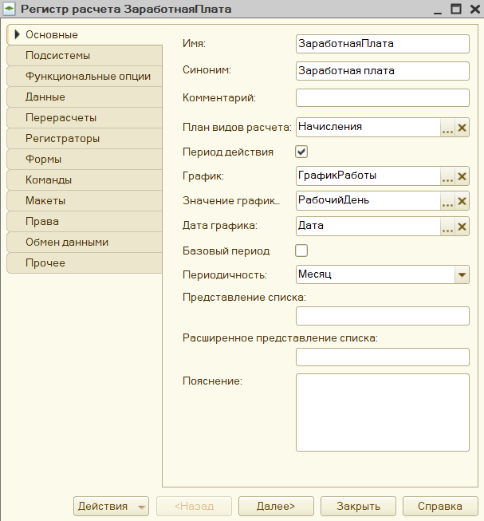
4. Создайте регистр сведений, описывающий график работы предприятия. Заполните данными этот регистр. Укажите связь регистра расчета с графиком.
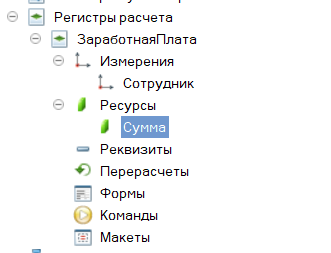

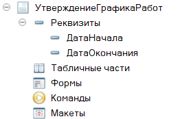
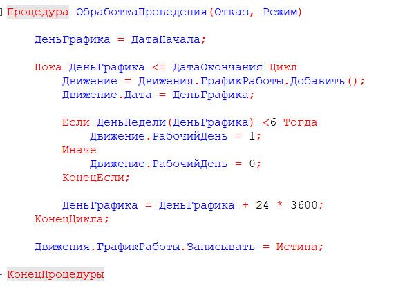
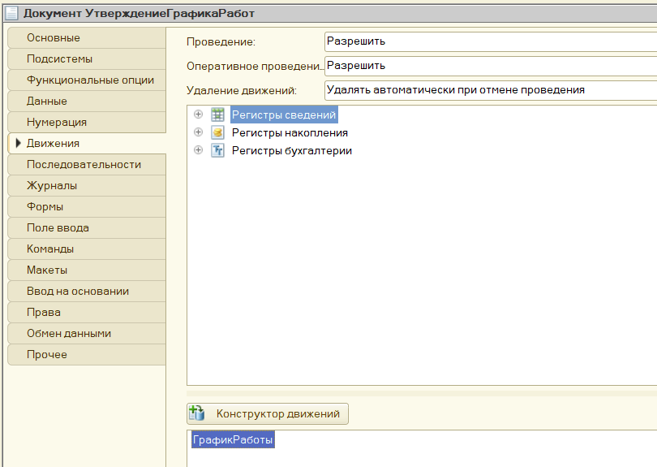
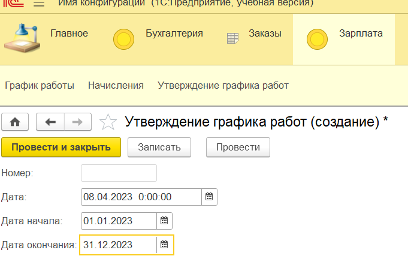
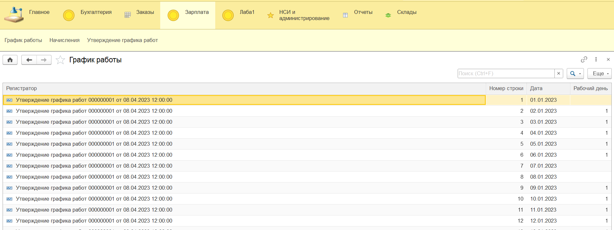
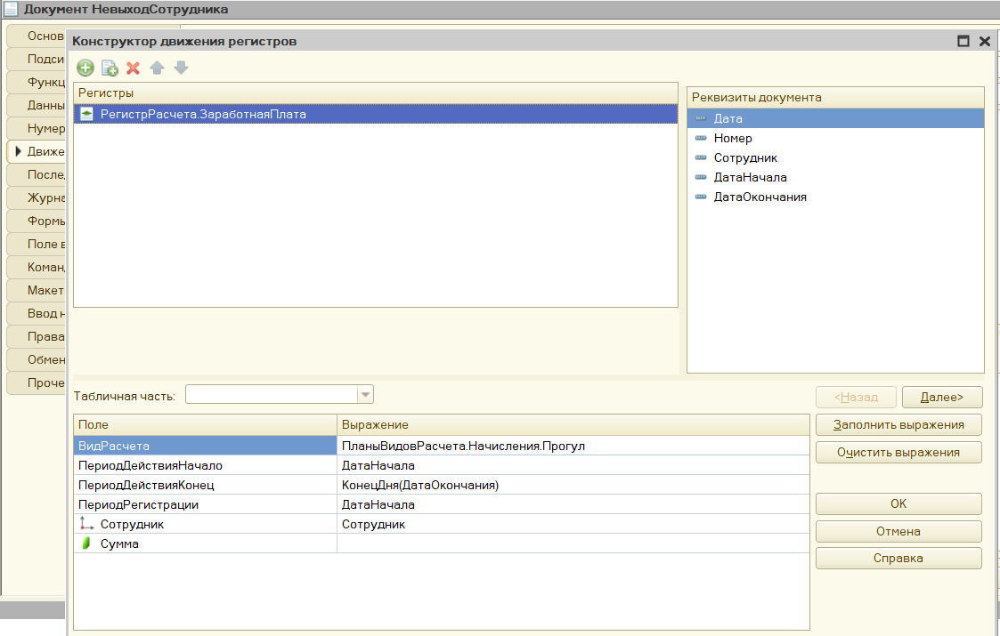
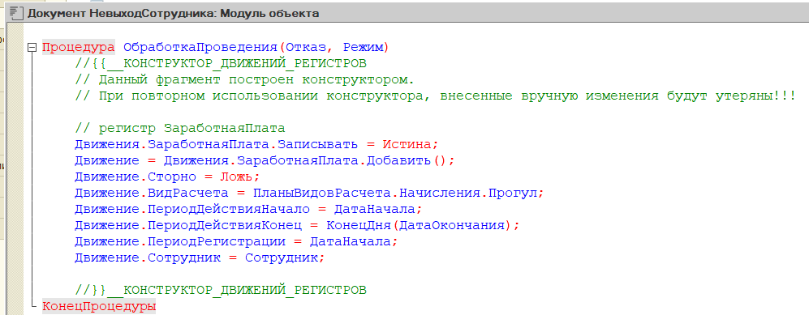
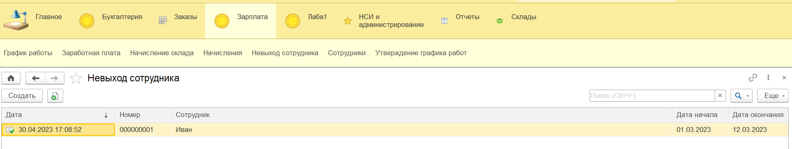

5. Обеспечьте расчет оклада сотрудника по дневном тарифу, расчет выполняется по формуле: Оклад по тарифу = Дневная оплата * Количество отработанных дней в месяце. Отработанные дни месяца определяются методом отклонений. 
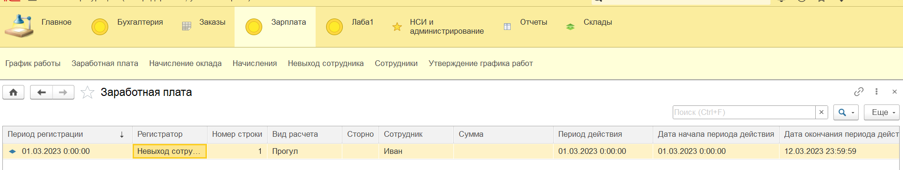
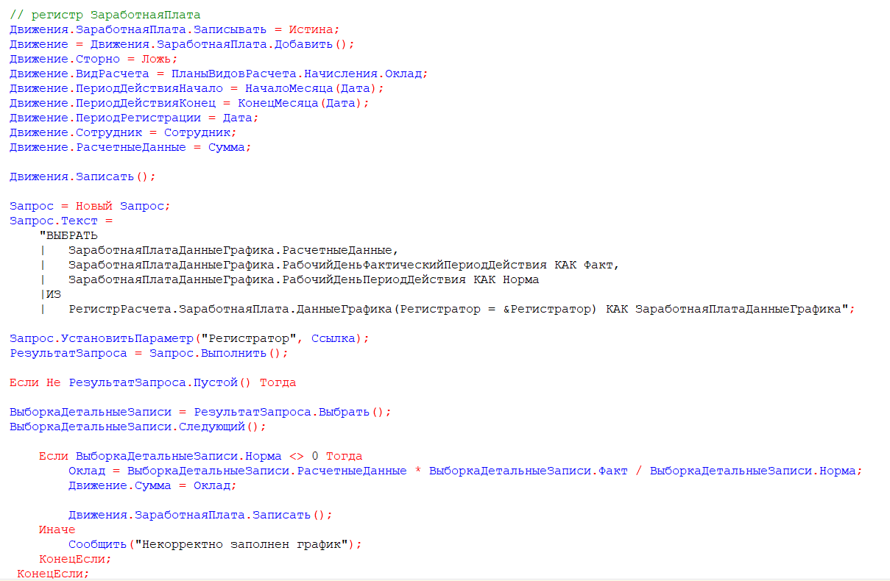
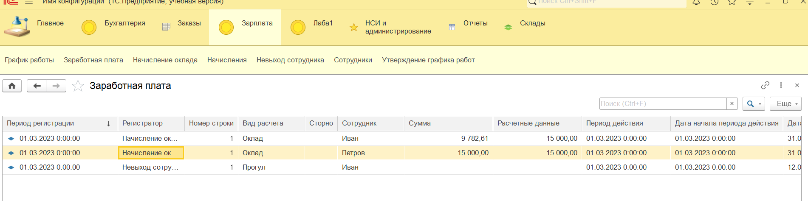
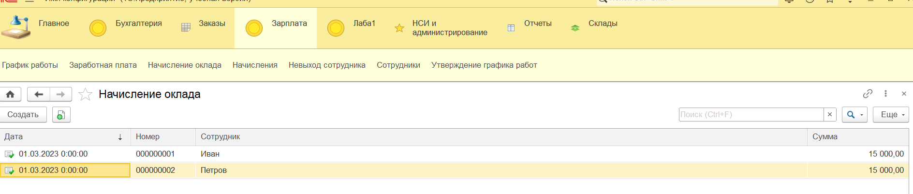

6. Создайте новый вид расчета «Премия суммой» - данный вид расчета не зависит ни от каких данных. Обеспечьте начисление премий сотрудникам, указанным в табличной части, вновь созданного документа.
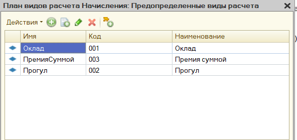
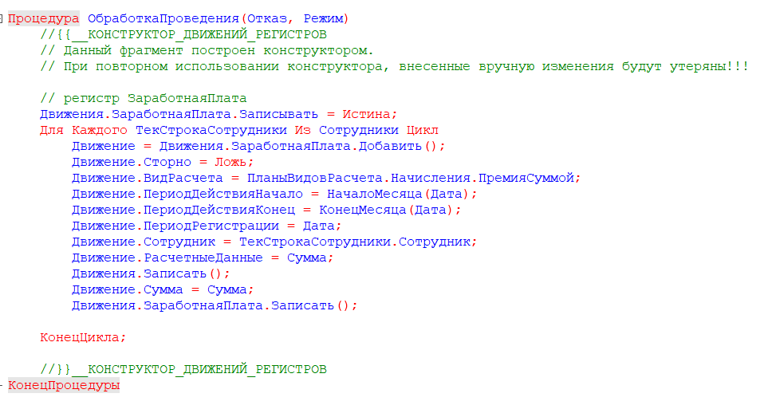
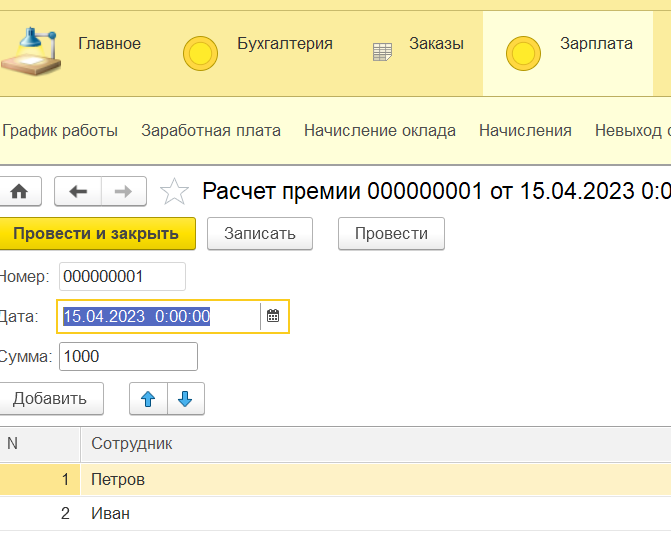
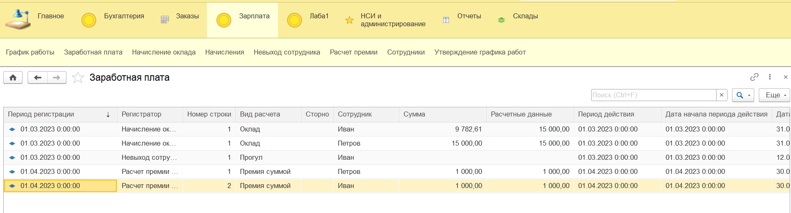
7. В пользовательском режиме введите документы, отражающие начисление оклада и премий.
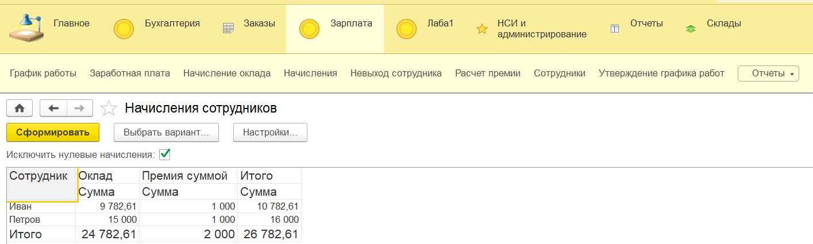